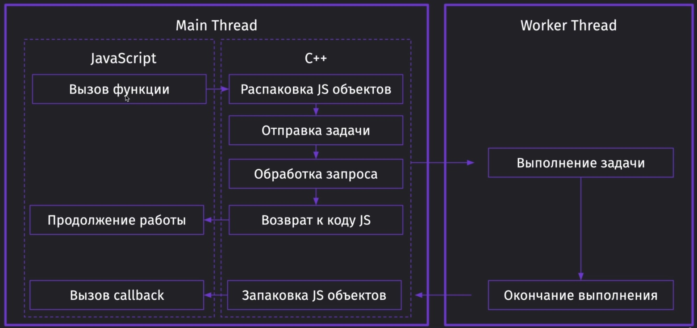
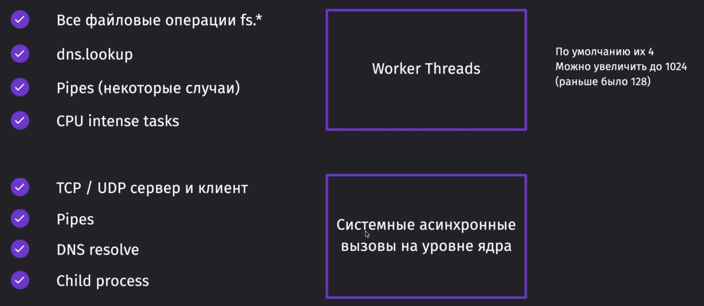

## Worker threads

Не все задачи идут в worker threads.

Также по дефолту w-t 4 штуки (т.к. 4 ядра в проце по дефолту), но можно увеличить до 1024.

_Чтобы изменить кол-во t-w нужно написать: process.env.UV_THREADPOOL_SIZE = {value}_
